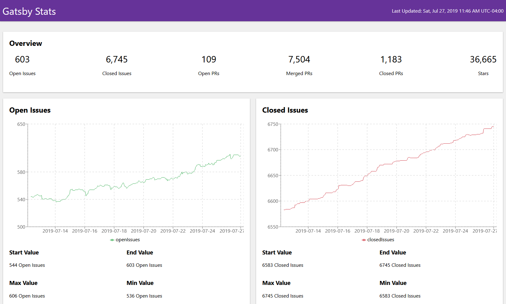

# Gatsby-theme-github-stats

A Gatsby Theme to display statistics for GitHub repos.



## Example Site

you can see a live running example site at [https://gatsby-theme-github-stats-example.netlify.com/](https://gatsby-theme-github-stats-example.netlify.com/).

This is the gatsby site in this repo at `site` deployed up to Netlify.

## Features

- Charts with [Recharts](http://recharts.org/) library

## Setup

Add the package to your gatsby site

```shell
yarn add gatsby-theme-github-stats
```

and then put it in your gatsby-config file

```js
module.exports = {
  siteMetadata: {
    title: '<title for page>'
    source: '<GitHub URL for your site>'
    repoNameWithOwner: '<github owner & repo in format of `owner/repo`>'
  }
  plugins: [
    {
      resolve: `gatsby-theme-github-stats`,
      options: {
        dataPath: path.join(__dirname, `src`, `data`),
      },
    },
  ],
}
```

Next, create a file at `src/data/data.json` in your gatsby site and have it as the following format:

```json
[
  {
    "stars": 35670,
    "openPRs": 84,
    "timestamp": 1560977138,
    "closedIssues": 6355,
    "closedPRs": 1094,
    "openIssues": 442,
    "mergedPRs": 6947
  }
]
```

Each item is a single datapoint. There is no max amount of datapoints you can have.

Then finally run `yarn develop` and you should see the fully fleshed out site with graphs and all.

## Config Options

These are all of the currently available fields in the `options` field in the gatsby-config plugin entry for this theme:

| Name     | Description                                                             | Default | Required |
| -------- | ----------------------------------------------------------------------- | ------- | -------- |
| basePath | url base path for the dashboard page to be created at (ex: `'/stats/'`) | '/'     | false    |
| dataPath | the filepath to your data directory                                     | N/A     | true     |

## Site Metadata

Some of the text around the site is customized by siteMetadata tokens.

| Name              | Description                                             | Example                                         | required |
| ----------------- | ------------------------------------------------------- | ----------------------------------------------- | -------- |
| title             | Title at the top left of the page and the `<title>` tag | Gatsby Stats                                    | true     |
| source            | url to source of the Gatsby site                        | https://github.com/lannonbr/gatsby-github-stats | false    |
| repoNameWithOwner | username & repo name on GitHub                          | gatsbyjs/gatsby                                 | false    |
